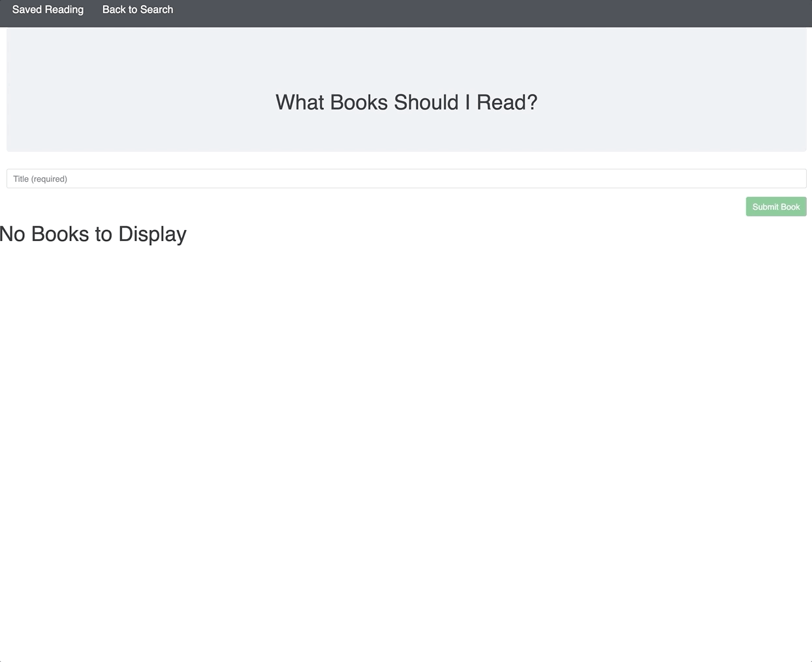

### Welcome to my Google Search App
### https://sleepy-journey-42159.herokuapp.com/



#### This is my very first MERN app, it is very chanllenging, but when I get all basic functions working, I feel really successful. I still need to working on more styling staff, but let me introduce my app a little bit.

#### Since this is a full stack app, we need to know how frontend and backend needs to talk to each other. I used REACT as the frontend, and I have to make sure I have added all necessary components.

#### I used 9 components:
 - Button
 - Form
 - Grid
 - Jumbotron
 - List
 - Nav
 - SaveBookList
 - SearchBookList
 - Thumbnail

 #### I set 2 pages for displaying books, one is search, which users can search a book, then other is saved page, so users can check their saves books

 #### There will be 5 elements displaying on each searched result: 
 - title
 - authors
 - publishedDate
 - image
 - bookLink
 - description

 #### When user save a book, the book information will be sent to the database, used handleSaveSubmit function:

 ``` javascript
 handleSaveSubmit = id => {
      const book = this.state.books.find(book => book.id === id)
      API.saveBook({
        title: book.volumeInfo.title,
        authors: book.volumeInfo.authors[0],
        publishedDate: book.volumeInfo.publishedDate,
        image: book.volumeInfo.imageLinks.thumbnail,
        bookLink: book.volumeInfo.infoLink,
        description: book.volumeInfo.description
      })
      .catch(err => console.log(err));  
    };
```
#### After the data has been sent to database, we can get the saved book information when we go to the saved book page. The saved book information will be automatically loaded when we go this page.

``` javascript
componentDidMount() {
  API.getBook()
  .then(res => this.setState({ saveBookArr: res.data}))
}
```

Technology I use for this project:
- React.js
- Mongoose
- css
- bootstrap
- express.js
- node.js

